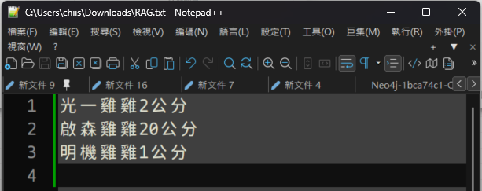
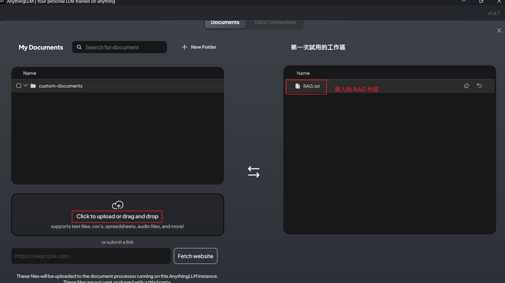

# AnythingLLM_RAG
AnythingLLM RAG - 打造自己的地端 AI 客服系統、AI 知識庫系統、AI 智慧助理、AI 專家機器人。


[View in English](./README_EN.md)

# RAG
RAG 代表「檢索增強生成」（Retrieval-Augmented Generation），是一種結合「資料檢索」和「生成式AI」的技術。  
它能讓大型語言模型（LLM）在回答問題前，先從外部知識庫（如企業內部資料）中檢索相關資訊，  
並將這些最新、準確的資料整合到生成的回應中，從而提高回答的準確性和可靠性，解決了LLM 資訊過時和產生幻覺的問題。 

## RAG 的運作方式
- 檢索（Retrieval）： 當使用者提出問題時，系統會先從外部知識庫（如文件、資料庫）中搜尋相關資訊。
- 增強（Augmentation）： 將檢索到的資訊與原始問題結合，形成更豐富、更具體的提示。
- 生成（Generation）： 大型語言模型（LLM）使用這個增強後的提示來產生最終答案。 

## RAG 的主要優點
- 提高準確性和時效性： 確保回答內容基於最新的、特定的資料，而不是僅僅依賴訓練時的靜態資料。 
- 成本效益高： 避免了重新訓練整個大型語言模型的巨大成本，而只需提供額外的知識庫。 
- 增加使用者信任： 可以提供回答的來源，讓使用者可以追查和驗證資訊，從而增加信任感。 
- 提供可控性： 開發者可以控制和更新知識來源，並能限制敏感資訊的存取，讓AI的回應更符合企業需求。 

## 應用場景
- 企業內部知識管理：: 讓員工能夠快速獲取公司內部文件和政策的準確答案。
- 客戶服務：: 讓聊天機器人能夠根據最新的產品資訊或常見問題提供準確的回應。
- 決策支援系統：: 提供基於最新數據的建議和分析。 

# 安裝
在終端機或命令提示字元中，拉取 AnythingLLM 的 Docker 映像檔：
```bash
docker pull mintplexlabs/anythingllm
```
在終端機或命令提示字元中，輸入以下命令來啟動 AnythingLLM 的 Docker 容器：
```bash
docker run -d -p 3001:3001 mintplexlabs/anythingllm
```

# 啟動
打開瀏覽器 在瀏覽器的網址欄中輸入 http://localhost:3001，就可以看到 anythingllm 應用程式的網頁介面。

# 安裝地端 LLM
在終端機或命令提示字元中，拉取 Ollama 的 Docker 映像檔：
```bash
docker pull ollama/ollama
```
在終端機或命令提示字元中，輸入以下命令來啟動 Ollama 的 Docker 容器：
- 僅 CPU
```bash
docker run -d -v ollama:/root/.ollama -p 11434:11434 --name ollama ollama/ollama
```
- Nvidia GPU
使用 Nvidia GPU 需要安裝一堆工具庫，這邊官網有提到，這邊就不贅述了。
```bash
docker run -d --gpus=all -v ollama:/root/.ollama -p 11434:11434 --name ollama ollama/ollama
```

# 建立 RAG 範例(以文字檔為例)

建立你的私人 RAG 文字檔案。

# 匯入 RAG 檔案

匯入之前寫好的 RAG 文字檔案。

# 在瀏覽器中訪問 AnythingLLM 網頁

打開瀏覽器 在瀏覽器的網址欄中輸入 `http://localhost:3001`，就可以看到 AnythingLLM 應用程式的網頁介面。

# 獲取 RAG 的資訊並生成資訊回應


