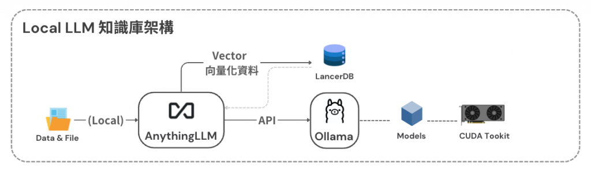
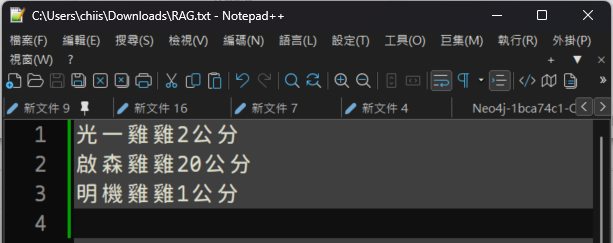
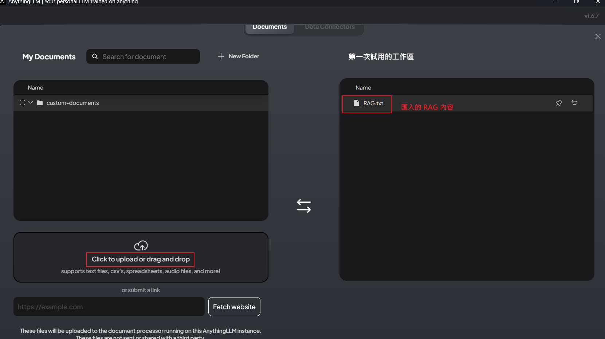
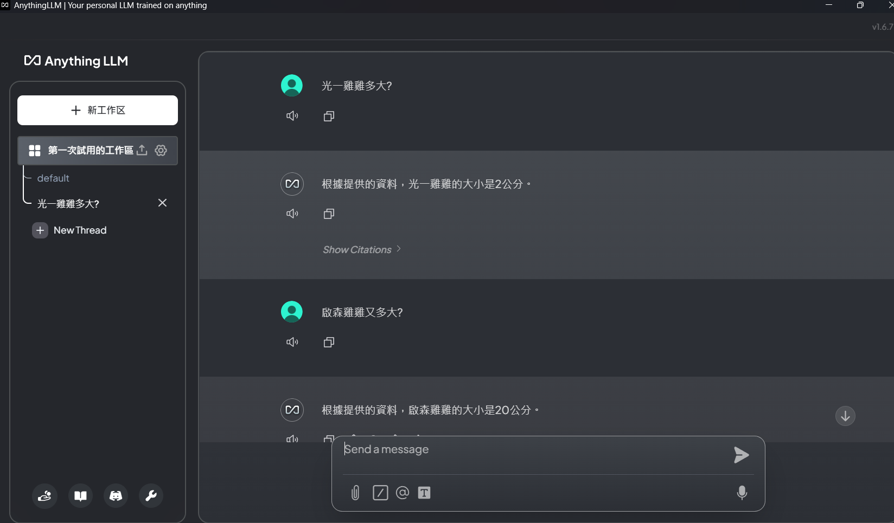
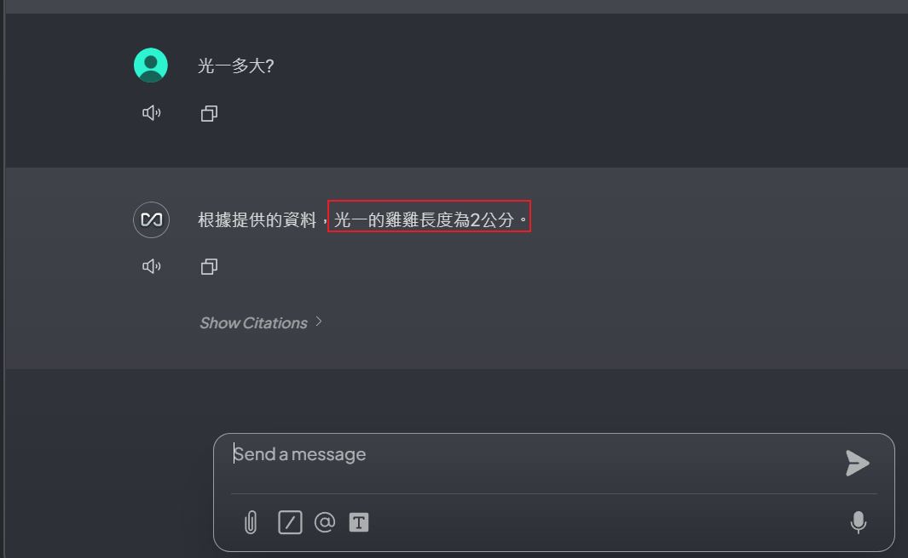

# AnythingLLM_RAG
AnythingLLM RAG - Build your own on-premises AI customer service system, AI knowledge base system, AI smart assistant, AI expert robot.



[切換到中文](./README.md)

# RAG
RAG stands for "Retrieval-Augmented Generation," a technology that combines "data retrieval" and "generative AI."  
It allows Large Language Models (LLM) to retrieve relevant information from external knowledge bases (such as internal enterprise data) before answering questions,  
and integrate this latest, accurate data into the generated responses, thereby improving the accuracy and reliability of answers and solving the problems of outdated information and hallucinations in LLMs.

## How RAG Works
- Retrieval: When a user asks a question, the system first searches for relevant information from external knowledge bases (such as documents, databases).
- Augmentation: Combine the retrieved information with the original question to form a richer, more specific prompt.
- Generation: Large Language Models (LLM) use this augmented prompt to generate the final answer.

## Main Advantages of RAG
- Improved accuracy and timeliness: Ensures that answer content is based on the latest, specific data rather than relying solely on static data from training time.
- Cost-effective: Avoids the huge cost of retraining the entire large language model, requiring only providing additional knowledge bases.
- Increased user trust: Can provide sources for answers, allowing users to trace and verify information, thereby increasing trust.
- Provides controllability: Developers can control and update knowledge sources, and can restrict access to sensitive information, making AI responses more aligned with enterprise needs.

## Application Scenarios
- Enterprise internal knowledge management: Allows employees to quickly obtain accurate answers about internal company documents and policies.
- Customer service: Enables chatbots to provide accurate responses based on the latest product information or frequently asked questions.
- Decision support systems: Provides recommendations and analysis based on the latest data.

# Installation
In terminal or command prompt, pull the AnythingLLM Docker image:
```bash
docker pull mintplexlabs/anythingllm
```
In terminal or command prompt, enter the following command to start the AnythingLLM Docker container:
```bash
docker run -d -p 3001:3001 mintplexlabs/anythingllm
```

# Startup
Open browser and enter http://localhost:3001 in the browser's address bar to see the AnythingLLM application's web interface.

# Install On-Premises LLM
In terminal or command prompt, pull the Ollama Docker image:
```bash
docker pull ollama/ollama
```
In terminal or command prompt, enter the following command to start the Ollama Docker container:
- CPU only
```bash
docker run -d -v ollama:/root/.ollama -p 11434:11434 --name ollama ollama/ollama
```
- Nvidia GPU
Using Nvidia GPU requires installing a bunch of tool libraries, which are mentioned on the official website, so we won't elaborate here.
```bash
docker run -d --gpus=all -v ollama:/root/.ollama -p 11434:11434 --name ollama ollama/ollama
```

# Create RAG Example (Using Text Files as Example)

Create your private RAG text file.

# Import RAG Files

Import the previously written RAG text file.

# Access AnythingLLM Web Page in Browser

Open browser and enter `http://localhost:3001` in the browser's address bar to see the AnythingLLM application's web interface.

# Retrieve RAG Information and Generate Information Response

